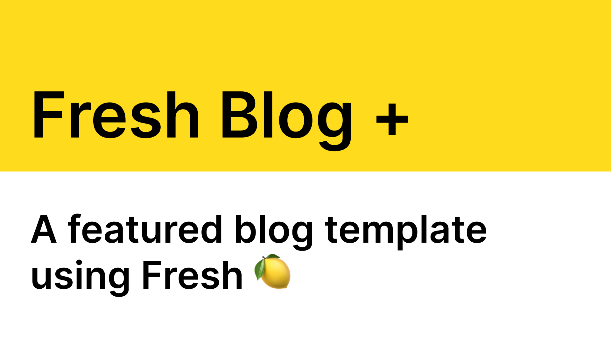

<p align="center">
  
</p>

<br/>
<div align="center">
  <a href="https://twitter.com/Amon_Yamamoto">
  
</a>

</div>
<br/>

# Fresh Blog+

[](https://fresh.deno.dev)

This is blog template using the awesome framework with many features included:

- [x] Markdown support
- [x] SEO meta tags
- [x] og image support [Fresh](https://fresh.deno.dev) from Deno.
- [x] sitemap
- [x] RSS feed
- [ ] Admin panel for managing posts

## Usage

### Start the project:

```
deno task start
```

This will watch the project directory and restart as necessary.

### Make it your own

To update the global site title, description, etc. edit the `data/site.ts` file.

To add new posts, create a new markdown file in the `data/posts` directory.

## Sponsor

If you find this template useful, please consider donating to support the
continued development of it with the link below

[Donate to Fresh Blog](https://littlesticks.lemonsqueezy.com/checkout/buy/ae636a97-0b45-4285-8250-41651a104b72)

## Support

This project is forked from
[fresh_blog](https://github.com/littlesticks/fresh-blog) You can reach in
[Join Little Sticks Discord](https://littlesticks.dev/discord)
